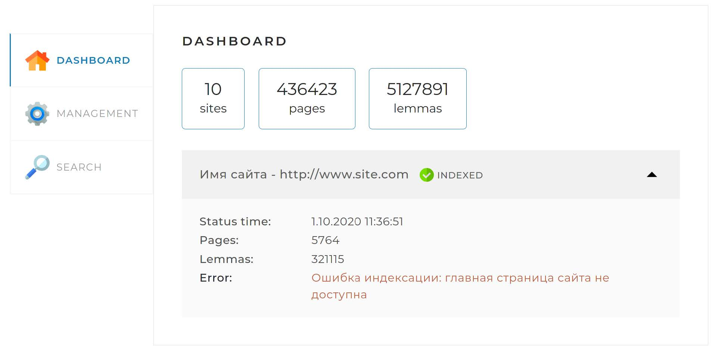

# Search engine 

"Поисковый движок" представляет собой Spring-приложение (JAR-файл, запускаемый на любом сервере или компьютере),
работающее с локально установленной базой данных MySQL, имеющее простой веб-интерфейс и API, через который им можно
управлять и получать результаты поисковой выдачи по запросу.

Принципы работы поискового движка:

1. В конфигурационном файле перед запуском приложения задаются адреса сайтов, по которым движок должен осуществлять
   поиск.
2. Поисковый движок самостоятельно обходит все страницы заданных сайтов и индексирует их (создавая так называемый
   индекс) так, чтобы потом находить наиболее релевантные страницы по любому поисковому запросу.
3. Пользователь присылает запрос через API движка. Запрос — это набор слов, по которым нужно найти страницы сайта.
4. Запрос определённым образом трансформируется в список слов, переведённых в базовую форму. Например, для
   существительных — именительный падеж, единственное число.
5. В индексе ищутся страницы, на которых встречаются все эти слова.
6. Результаты поиска ранжируются, сортируются и отдаются пользователю.

## Описание веб-интерфейса

Веб-интерфейс (frontend-составляющая) проекта представляет собой одну веб-страницу с тремя вкладками:

- __Dashboard.__ Эта вкладка открывается по умолчанию. На ней отображается общая статистика по всем сайтам, а также
  детальная статистика и статус по каждому из сайтов (статистика, получаемая по запросу /api/statistics):
  
- __Management.__ На этой вкладке находятся инструменты управления поисковым движком — запуск и остановка полной
  индексации (переиндексации), а также возможность добавить (обновить) отдельную страницу по ссылке:
  
- __Search.__ Эта страница предназначена для тестирования поискового движка. На ней находится поле поиска, выпадающий
  список с выбором сайта для поиска, а при нажатии на кнопку «Найти» выводятся результаты поиска (по API-запросу
  /api/search).
  
  Вся информация на вкладки подгружается путём запросов к API вашего приложения. При нажатии кнопок также отправляются
  запросы.

### Спецификация API

В приложении реализован класс ApiController с методами для выполнения запросов. Для отправления запросов, помимо
веб-интерфейса приложения, так же можно использовать расширения в браузере таких как postman и api tester. Посредством
get и post запросов методы возвращают ответ в формате JSON и выполняют следующие задачи:

1. Запуск полной индексации — GET /api/startIndexing. Метод запускает полную индексацию всех сайтов или полную
   переиндексацию, если они уже проиндексированы. Если в настоящий момент индексация или переиндексация уже запущена,
   метод возвращает сообщение об ошибке.
2. Остановка текущей индексации — GET /api/stopIndexing. Метод останавливает текущий процесс индексации (
   переиндексации). Если в настоящий момент индексация или переиндексация не происходит, метод возвращает сообщение об
   ошибке.
3. Добавление или обновление отдельной страницы — POST /api/indexPage. Метод добавляет в индекс или обновляет отдельную
   страницу, адрес которой передан в параметре. Если адрес страницы передан неверно, метод возвращает ошибку.
   Параметры:
    - url — адрес страницы, которую нужно переиндексировать.
4. Статистика — GET /api/statistics. Метод возвращает статистику и другую служебную информацию о состоянии поисковых
   индексов и самого движка.
5. Получение данных по поисковому запросу — GET /api/search. Метод осуществляет поиск страниц по переданному поисковому
   запросу (параметр query). Чтобы выводить результаты порционно, также можно задать параметры offset (сдвиг от начала
   списка результатов) и limit (количество результатов, которое необходимо вывести). В ответе выводится общее количество
   результатов (count), не зависящее от значений параметров offset и limit, и массив data с результатами поиска. Если
   поисковый запрос не задан или ещё нет готового индекса (сайт, по которому ищем, или все сайты сразу не
   проиндексированы), метод возвращает ошибку.
   Параметры:
    - query — поисковый запрос;
    - site — сайт, по которому осуществляется поиск (если не задан, поиск происходит по всем проиндексированным сайтам).
      Задаётся в формате адреса, например: http://www.site.com (без слэша в конце);
    - offset — сдвиг от 0 для постраничного вывода (параметр необязательный; если не установлен, то значение по
      умолчанию равно нулю);
    - limit — количество результатов, которое необходимо вывести (параметр необязательный; если не установлен, то
      значение по умолчанию равно 20).

[Вверх](#anchor)
